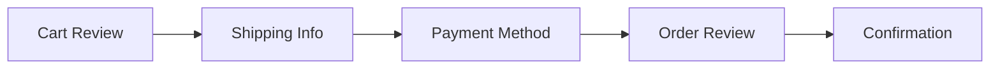
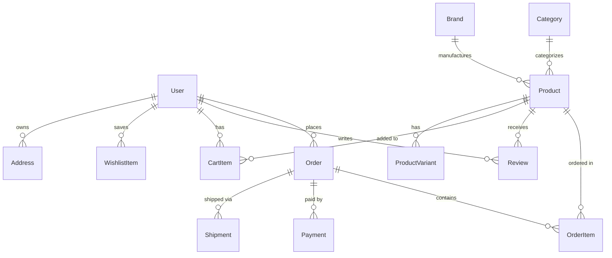

# AsiaShop Customer Portal - Full Web Application Planning

## 🎯 Project Overview

**Project Name:** AsiaShop Customer Portal  
**Technology Stack:** Next.js 15.5, React 19, TypeScript, Tailwind CSS, PostgreSQL, Prisma ORM  
**Target Platform:** Web (Desktop & Mobile Responsive)  
**Development Timeline:** Q4 2024 - Q1 2025  

---

## 📋 Table of Contents

1. [Architecture Overview](#architecture-overview)
2. [Feature Modules](#feature-modules)
3. [Technical Implementation](#technical-implementation)
4. [UI/UX Design System](#uiux-design-system)
5. [Database Schema](#database-schema)
6. [API Structure](#api-structure)
7. [Security & Compliance](#security--compliance)
8. [Performance Optimization](#performance-optimization)
9. [Development Phases](#development-phases)
10. [Testing Strategy](#testing-strategy)

---

## 🏗️ Architecture Overview

### System Architecture
```
┌─────────────────────────────────────────────────────────────┐
│                        Frontend (Next.js)                    │
├─────────────────────────────────────────────────────────────┤
│  Pages/Routes │ Components │ State Mgmt │ Utils │ Hooks    │
├─────────────────────────────────────────────────────────────┤
│                     API Routes (Next.js)                     │
├─────────────────────────────────────────────────────────────┤
│                    Business Logic Layer                      │
├─────────────────────────────────────────────────────────────┤
│  Auth Service │ Product Service │ Order Service │ AI Service│
├─────────────────────────────────────────────────────────────┤
│                     Data Access Layer                        │
├─────────────────────────────────────────────────────────────┤
│                    Prisma ORM │ Redis Cache                  │
├─────────────────────────────────────────────────────────────┤
│                PostgreSQL DB │ File Storage │ External APIs  │
└─────────────────────────────────────────────────────────────┘
```

### Folder Structure
```
asiashop-customer/
├── src/
│   ├── app/                    # Next.js app directory
│   │   ├── (auth)/             # Auth group routes
│   │   ├── (shop)/             # Shopping routes
│   │   ├── (user)/             # User account routes
│   │   ├── api/                # API endpoints
│   │   └── layout.tsx          # Root layout
│   ├── components/             # Reusable components
│   │   ├── ui/                 # Base UI components
│   │   ├── forms/              # Form components
│   │   ├── layout/             # Layout components
│   │   ├── product/            # Product components
│   │   ├── cart/               # Cart components
│   │   ├── auth/               # Auth components
│   │   └── support/            # Support components
│   ├── lib/                    # Utilities and configs
│   │   ├── auth/               # Auth utilities
│   │   ├── db/                 # Database client
│   │   ├── utils/              # Helper functions
│   │   ├── validations/        # Zod schemas
│   │   └── api/                # API clients
│   ├── hooks/                  # Custom React hooks
│   ├── types/                  # TypeScript definitions
│   ├── store/                  # State management
│   └── styles/                 # Global styles
├── public/                     # Static assets
├── prisma/                     # Database schema
└── tests/                      # Test files
```

---

## 🚀 Feature Modules

### 1. Authentication & User Management
```
STATUS: ✅ Completed
```

#### Features Implemented
- [x] User registration with email verification
- [x] Secure login with JWT tokens
- [x] Social login (Google, Facebook)
- [x] Password reset functionality
- [x] Session management
- [x] Protected routes middleware

#### Components
- `LoginPage` - User login interface
- `RegisterPage` - New user registration
- `AuthProvider` - Authentication context wrapper
- `useAuth` - Custom auth hook

### 2. User Dashboard & Profile
```
STATUS: ✅ Completed
```

#### Features Implemented
- [x] Dashboard with statistics overview
- [x] Recent orders display
- [x] Quick action links
- [x] Profile management API
- [x] User preferences

#### Components
- `DashboardPage` - Main dashboard view
- `StatsCard` - Statistics display cards
- `RecentOrders` - Order history widget
- `QuickActions` - Action buttons grid

### 3. Product Catalog & Search
```
STATUS: 🚧 In Progress
```

#### Planned Features
- [ ] Product listing with pagination
- [ ] Advanced filtering system
  - Category filter
  - Price range slider
  - Brand selection
  - Rating filter
  - Availability toggle
- [ ] Search functionality
  - Real-time search suggestions
  - Search history
  - Voice search (optional)
- [ ] Product detail pages
  - Image gallery with zoom
  - Product specifications
  - Size/variant selector
  - Stock availability
- [ ] Product comparison tool
- [ ] Recently viewed products

#### Component Structure
```typescript
// Product Components
├── ProductGrid
│   ├── ProductCard
│   ├── ProductSkeleton
│   └── LoadMoreButton
├── ProductFilters
│   ├── CategoryFilter
│   ├── PriceRangeFilter
│   ├── BrandFilter
│   └── RatingFilter
├── ProductDetail
│   ├── ImageGallery
│   ├── ProductInfo
│   ├── VariantSelector
│   └── AddToCartSection
└── SearchBar
    ├── SearchInput
    ├── SearchSuggestions
    └── SearchResults
```

### 4. Shopping Cart & Checkout
```
STATUS: 📋 Planned
```

#### Planned Features
- [ ] Persistent shopping cart
- [ ] Cart drawer/modal
- [ ] Quantity adjustments
- [ ] Item removal
- [ ] Apply coupon codes
- [ ] Shipping calculator
- [ ] Multi-step checkout
  - Shipping information
  - Payment method
  - Order review
  - Confirmation
- [ ] Guest checkout option
- [ ] Saved addresses
- [ ] Multiple payment methods
  - Credit/Debit cards
  - PayPal
  - Digital wallets
  - Bank transfer

#### Checkout Flow


### 5. Order Management
```
STATUS: 📋 Planned
```

#### Planned Features
- [ ] Order history listing
- [ ] Order detail view
- [ ] Real-time order tracking
- [ ] Order status timeline
- [ ] Cancel order (conditions apply)
- [ ] Return/refund requests
- [ ] Re-order functionality
- [ ] Invoice download (PDF)
- [ ] Delivery tracking integration

### 6. Wishlist & Favorites
```
STATUS: 📋 Planned
```

#### Planned Features
- [ ] Add/remove from wishlist
- [ ] Wishlist page
- [ ] Share wishlist
- [ ] Price drop notifications
- [ ] Stock alerts
- [ ] Move to cart functionality
- [ ] Collections/boards

### 7. Reviews & Ratings
```
STATUS: 📋 Planned
```

#### Planned Features
- [ ] Write product reviews
- [ ] Star rating system
- [ ] Photo/video uploads
- [ ] Helpful/unhelpful voting
- [ ] Review filtering
- [ ] Verified purchase badge
- [ ] Review moderation
- [ ] Review responses

### 8. Customer Support
```
STATUS: 📋 Planned
```

#### Planned Features
- [ ] AI-powered chatbot
- [ ] Support ticket system
- [ ] FAQ/Knowledge base
- [ ] Live chat integration
- [ ] Contact forms
- [ ] Order-specific inquiries
- [ ] Chat history
- [ ] File attachments

### 9. Notifications System
```
STATUS: 📋 Planned
```

#### Planned Features
- [ ] In-app notification center
- [ ] Email notifications
- [ ] Push notifications (PWA)
- [ ] SMS notifications
- [ ] Notification preferences
- [ ] Real-time updates (WebSocket)
- [ ] Notification categories
  - Order updates
  - Promotions
  - Price drops
  - Stock alerts
  - System messages

### 10. AI & Personalization
```
STATUS: 📋 Planned
```

#### Planned Features
- [ ] Personalized recommendations
- [ ] Smart search with NLP
- [ ] Visual search
- [ ] Dynamic pricing alerts
- [ ] Browsing history analysis
- [ ] Predictive text
- [ ] Size recommendations
- [ ] Style preferences
- [ ] Abandoned cart recovery

---

## 🎨 UI/UX Design System

### Design Principles
1. **Simplicity** - Clean, uncluttered interface
2. **Consistency** - Uniform design patterns
3. **Accessibility** - WCAG 2.1 AA compliant
4. **Performance** - Fast loading, smooth interactions
5. **Mobile-first** - Responsive design approach

### Color Palette
```scss
// Primary Colors
$primary-50:  #eff6ff;
$primary-100: #dbeafe;
$primary-200: #bfdbfe;
$primary-300: #93c5fd;
$primary-400: #60a5fa;
$primary-500: #3b82f6;
$primary-600: #2563eb;
$primary-700: #1d4ed8;
$primary-800: #1e40af;
$primary-900: #1e3a8a;

// Neutral Colors
$gray-50:  #f9fafb;
$gray-100: #f3f4f6;
$gray-200: #e5e7eb;
$gray-300: #d1d5db;
$gray-400: #9ca3af;
$gray-500: #6b7280;
$gray-600: #4b5563;
$gray-700: #374151;
$gray-800: #1f2937;
$gray-900: #111827;

// Semantic Colors
$success: #10b981;
$warning: #f59e0b;
$error:   #ef4444;
$info:    #3b82f6;
```

### Typography
```scss
// Font Family
$font-primary: 'Inter', system-ui, sans-serif;
$font-mono: 'JetBrains Mono', monospace;

// Font Sizes
$text-xs:   0.75rem;  // 12px
$text-sm:   0.875rem; // 14px
$text-base: 1rem;     // 16px
$text-lg:   1.125rem; // 18px
$text-xl:   1.25rem;  // 20px
$text-2xl:  1.5rem;   // 24px
$text-3xl:  1.875rem; // 30px
$text-4xl:  2.25rem;  // 36px
$text-5xl:  3rem;     // 48px
```

### Component Library
- **Base Components**: Button, Input, Select, Checkbox, Radio
- **Layout**: Container, Grid, Flex, Spacer
- **Navigation**: Header, Footer, Sidebar, Breadcrumb
- **Data Display**: Table, List, Card, Badge, Avatar
- **Feedback**: Alert, Toast, Modal, Loading, Progress
- **Forms**: FormField, FormGroup, Validation

### Responsive Breakpoints
```scss
$breakpoints: (
  'xs': 320px,   // Mobile devices
  'sm': 640px,   // Small tablets
  'md': 768px,   // Tablets
  'lg': 1024px,  // Desktop
  'xl': 1280px,  // Large screens
  '2xl': 1536px  // Extra large screens
);
```

---

## 💾 Database Schema

### Core Entities

#### User System
- `users` - User accounts and profiles
- `accounts` - OAuth provider accounts
- `sessions` - Active user sessions
- `verification_tokens` - Email/phone verification
- `user_preferences` - User settings
- `addresses` - Shipping/billing addresses

#### Product System
- `products` - Product catalog
- `product_variants` - Size/color variants
- `categories` - Product categories
- `brands` - Product brands
- `product_images` - Product media

#### Order System
- `orders` - Customer orders
- `order_items` - Order line items
- `payments` - Payment transactions
- `shipments` - Shipping information
- `returns` - Return requests

#### Support System
- `support_tickets` - Customer tickets
- `ticket_messages` - Ticket conversations
- `faqs` - Frequently asked questions

#### Review System
- `reviews` - Product reviews
- `review_votes` - Helpful votes

#### Notification System
- `notifications` - User notifications
- `notification_preferences` - Settings

### Database Relationships


---

## 🔌 API Structure

### RESTful Endpoints

#### Authentication
```
POST   /api/auth/register     - User registration
POST   /api/auth/login        - User login
POST   /api/auth/logout       - User logout
POST   /api/auth/refresh      - Refresh token
POST   /api/auth/forgot       - Password reset request
POST   /api/auth/reset        - Password reset confirm
POST   /api/auth/verify       - Email verification
```

#### User Management
```
GET    /api/profile           - Get user profile
PUT    /api/profile           - Update profile
DELETE /api/profile           - Delete account
GET    /api/profile/addresses - Get addresses
POST   /api/profile/addresses - Add address
PUT    /api/profile/addresses/:id - Update address
DELETE /api/profile/addresses/:id - Delete address
```

#### Products
```
GET    /api/products          - List products
GET    /api/products/:id      - Get product details
GET    /api/products/search   - Search products
GET    /api/categories        - List categories
GET    /api/brands            - List brands
POST   /api/products/compare  - Compare products
```

#### Shopping Cart
```
GET    /api/cart              - Get cart items
POST   /api/cart/add          - Add to cart
PUT    /api/cart/update       - Update quantity
DELETE /api/cart/remove       - Remove item
DELETE /api/cart/clear        - Clear cart
POST   /api/cart/apply-coupon - Apply coupon
```

#### Orders
```
GET    /api/orders            - List orders
GET    /api/orders/:id        - Get order details
POST   /api/orders/create     - Create order
POST   /api/orders/:id/cancel - Cancel order
POST   /api/orders/:id/return - Request return
GET    /api/orders/:id/track  - Track order
GET    /api/orders/:id/invoice - Download invoice
```

#### Reviews
```
GET    /api/reviews/product/:id - Get product reviews
POST   /api/reviews/create      - Create review
PUT    /api/reviews/:id         - Update review
DELETE /api/reviews/:id         - Delete review
POST   /api/reviews/:id/vote    - Vote helpful
```

#### Wishlist
```
GET    /api/wishlist          - Get wishlist
POST   /api/wishlist/add      - Add item
DELETE /api/wishlist/remove   - Remove item
POST   /api/wishlist/to-cart  - Move to cart
```

#### Notifications
```
GET    /api/notifications     - List notifications
PUT    /api/notifications/:id/read - Mark as read
PUT    /api/notifications/read-all - Mark all read
DELETE /api/notifications/:id - Delete notification
GET    /api/notifications/preferences - Get preferences
PUT    /api/notifications/preferences - Update preferences
```

#### Support
```
GET    /api/support/tickets   - List tickets
GET    /api/support/tickets/:id - Get ticket
POST   /api/support/tickets   - Create ticket
POST   /api/support/tickets/:id/message - Send message
PUT    /api/support/tickets/:id/close - Close ticket
GET    /api/support/faq       - Get FAQs
```

### GraphQL Schema (Optional)
```graphql
type Query {
  # User queries
  me: User
  user(id: ID!): User
  
  # Product queries
  products(filter: ProductFilter, pagination: Pagination): ProductConnection
  product(id: ID!): Product
  
  # Order queries
  orders(filter: OrderFilter, pagination: Pagination): OrderConnection
  order(id: ID!): Order
}

type Mutation {
  # Auth mutations
  register(input: RegisterInput!): AuthPayload
  login(input: LoginInput!): AuthPayload
  logout: Boolean
  
  # Cart mutations
  addToCart(input: AddToCartInput!): Cart
  updateCartItem(input: UpdateCartInput!): Cart
  removeFromCart(productId: ID!): Cart
  
  # Order mutations
  createOrder(input: CreateOrderInput!): Order
  cancelOrder(id: ID!): Order
}

type Subscription {
  # Real-time updates
  orderStatusChanged(orderId: ID!): Order
  notificationReceived: Notification
}
```

---

## 🔒 Security & Compliance

### Security Measures

#### Authentication & Authorization
- [x] JWT token-based authentication
- [x] Refresh token rotation
- [x] Session management
- [ ] Two-factor authentication (2FA)
- [ ] OAuth 2.0 social login
- [ ] Role-based access control (RBAC)

#### Data Protection
- [ ] Password hashing (bcrypt)
- [ ] Data encryption at rest
- [ ] TLS/SSL for data in transit
- [ ] SQL injection prevention
- [ ] XSS protection
- [ ] CSRF tokens
- [ ] Rate limiting
- [ ] Input validation/sanitization

#### Privacy & Compliance
- [ ] GDPR compliance
  - Data export
  - Right to deletion
  - Cookie consent
  - Privacy policy
- [ ] PCI DSS compliance (payment)
- [ ] CCPA compliance
- [ ] Data retention policies
- [ ] Audit logging

### Security Headers
```typescript
// next.config.ts security headers
const securityHeaders = [
  {
    key: 'X-DNS-Prefetch-Control',
    value: 'on'
  },
  {
    key: 'Strict-Transport-Security',
    value: 'max-age=63072000; includeSubDomains; preload'
  },
  {
    key: 'X-Frame-Options',
    value: 'SAMEORIGIN'
  },
  {
    key: 'X-Content-Type-Options',
    value: 'nosniff'
  },
  {
    key: 'Referrer-Policy',
    value: 'origin-when-cross-origin'
  },
  {
    key: 'Content-Security-Policy',
    value: "default-src 'self'; img-src 'self' data: https:; script-src 'self' 'unsafe-eval' 'unsafe-inline';"
  }
]
```

---

## ⚡ Performance Optimization

### Frontend Optimization

#### Code Splitting & Lazy Loading
```typescript
// Dynamic imports for route-based splitting
const ProductDetail = dynamic(() => import('./ProductDetail'))
const Checkout = dynamic(() => import('./Checkout'))
```

#### Image Optimization
- Next.js Image component
- Responsive images
- WebP format
- Lazy loading
- Blur placeholders

#### Bundle Optimization
- Tree shaking
- Code minification
- Compression (gzip/brotli)
- Bundle analysis
- Vendor chunk splitting

### Backend Optimization

#### Database
- Query optimization
- Indexing strategy
- Connection pooling
- Query caching
- Pagination

#### Caching Strategy
```typescript
// Cache layers
1. Browser cache (static assets)
2. CDN cache (Cloudflare/Vercel)
3. Redis cache (API responses)
4. Database query cache
```

#### API Performance
- Response compression
- Field filtering
- Pagination
- Rate limiting
- Request batching

### Performance Metrics
```typescript
// Target metrics
- First Contentful Paint (FCP): < 1.8s
- Largest Contentful Paint (LCP): < 2.5s
- First Input Delay (FID): < 100ms
- Cumulative Layout Shift (CLS): < 0.1
- Time to Interactive (TTI): < 3.8s
```

---

## 📅 Development Phases

### Phase 1: Foundation (Weeks 1-2) ✅
- [x] Project setup and configuration
- [x] Database schema design
- [x] Authentication system
- [x] Basic routing and layouts
- [x] User registration/login

### Phase 2: Core Features (Weeks 3-4) ✅
- [x] User dashboard
- [x] Profile management
- [x] Navigation and header
- [x] State management setup

### Phase 3: Product Catalog (Weeks 5-6) 🚧
- [ ] Product listing page
- [ ] Product detail page
- [ ] Search functionality
- [ ] Filtering system
- [ ] Category browsing

### Phase 4: Shopping Experience (Weeks 7-8)
- [ ] Shopping cart
- [ ] Checkout process
- [ ] Payment integration
- [ ] Order confirmation

### Phase 5: Order Management (Weeks 9-10)
- [ ] Order history
- [ ] Order tracking
- [ ] Returns/refunds
- [ ] Invoice generation

### Phase 6: User Features (Weeks 11-12)
- [ ] Wishlist
- [ ] Product reviews
- [ ] Address management
- [ ] Preferences

### Phase 7: Support & Communication (Weeks 13-14)
- [ ] Support tickets
- [ ] FAQ system
- [ ] Chat integration
- [ ] Contact forms

### Phase 8: Advanced Features (Weeks 15-16)
- [ ] AI recommendations
- [ ] Notifications
- [ ] Analytics dashboard
- [ ] Social features

### Phase 9: Optimization (Weeks 17-18)
- [ ] Performance tuning
- [ ] SEO optimization
- [ ] PWA features
- [ ] Security audit

### Phase 10: Launch Preparation (Weeks 19-20)
- [ ] Testing & QA
- [ ] Documentation
- [ ] Deployment setup
- [ ] Monitoring setup

---

## 🧪 Testing Strategy

### Testing Levels

#### Unit Testing
```typescript
// Jest + React Testing Library
- Component rendering
- Hook functionality
- Utility functions
- API handlers
- Validation schemas
```

#### Integration Testing
```typescript
// Cypress/Playwright
- User flows
- API integration
- Database operations
- Payment processing
- Third-party services
```

#### E2E Testing
```typescript
// Critical user journeys
- Registration → Login → Browse → Purchase
- Cart → Checkout → Payment → Confirmation
- Profile → Orders → Returns
- Search → Filter → Product → Review
```

### Test Coverage Goals
- Unit tests: 80%
- Integration tests: 60%
- E2E tests: Critical paths

### Testing Checklist
- [ ] Accessibility testing (WCAG 2.1)
- [ ] Cross-browser testing
- [ ] Mobile responsiveness
- [ ] Performance testing
- [ ] Security testing
- [ ] Load testing
- [ ] Usability testing

---

## 📊 Analytics & Monitoring

### Analytics Implementation
- Google Analytics 4
- Custom event tracking
- Conversion funnel analysis
- User behavior tracking
- A/B testing framework

### Monitoring Stack
```yaml
Application Monitoring:
  - Sentry (Error tracking)
  - Vercel Analytics (Performance)
  - LogRocket (Session replay)

Infrastructure Monitoring:
  - Uptime monitoring
  - Database metrics
  - API response times
  - Resource utilization

Business Metrics:
  - Conversion rate
  - Cart abandonment
  - Average order value
  - Customer lifetime value
```

---

## 🚀 Deployment Strategy

### Environments
```yaml
Development:
  URL: http://localhost:3000
  Database: PostgreSQL (local)
  
Staging:
  URL: https://staging.asiashop.com
  Database: PostgreSQL (staging)
  
Production:
  URL: https://asiashop.com
  Database: PostgreSQL (production)
```

### CI/CD Pipeline
```yaml
Pipeline Steps:
  1. Code commit
  2. Automated tests
  3. Build verification
  4. Deploy to staging
  5. Integration tests
  6. Deploy to production
  7. Smoke tests
  8. Monitoring alerts
```

### Infrastructure
- **Hosting**: Vercel/AWS
- **Database**: PostgreSQL (Supabase/AWS RDS)
- **File Storage**: AWS S3/Cloudinary
- **CDN**: Cloudflare
- **Email**: SendGrid/AWS SES
- **Search**: Algolia/Elasticsearch

---

## 📝 Documentation

### Technical Documentation
- API documentation (OpenAPI/Swagger)
- Database schema documentation
- Component library (Storybook)
- Development guidelines
- Deployment procedures

### User Documentation
- User manual
- FAQ section
- Video tutorials
- Feature guides
- Troubleshooting

---

## 🎯 Success Metrics

### Technical KPIs
- Page load time < 2 seconds
- API response time < 200ms
- 99.9% uptime
- Zero critical security issues
- Mobile score > 90 (Lighthouse)

### Business KPIs
- User registration rate
- Conversion rate > 3%
- Cart abandonment < 70%
- Customer satisfaction > 4.5/5
- Return customer rate > 30%

---

## 📞 Team & Resources

### Development Team
- **Frontend Developer**: UI/UX implementation
- **Backend Developer**: API and business logic
- **Database Administrator**: Database design and optimization
- **DevOps Engineer**: Infrastructure and deployment
- **QA Engineer**: Testing and quality assurance
- **UI/UX Designer**: Design and user experience

### External Services
- Payment Gateway: Stripe
- Email Service: SendGrid
- SMS Service: Twilio
- Analytics: Google Analytics
- Monitoring: Sentry
- AI/ML: OpenAI API

---

## 🔄 Maintenance & Updates

### Regular Maintenance
- Weekly security updates
- Monthly dependency updates
- Quarterly performance review
- Annual security audit

### Feature Roadmap
- Q1 2025: Core platform launch
- Q2 2025: Mobile app development
- Q3 2025: B2B features
- Q4 2025: International expansion

---

## 📌 Notes & Considerations

### Technical Debt
- Refactor authentication flow
- Optimize database queries
- Implement caching layer
- Add comprehensive logging

### Future Enhancements
- Voice commerce
- AR product preview
- Blockchain integration
- Social commerce features
- Subscription model

### Risk Management
- Data breach protocols
- Disaster recovery plan
- Scalability planning
- Vendor lock-in mitigation

---

## ✅ Completion Checklist

### Pre-Launch
- [ ] All critical features implemented
- [ ] Security audit completed
- [ ] Performance optimization done
- [ ] Documentation complete
- [ ] Testing coverage met
- [ ] Legal compliance verified
- [ ] Backup systems tested
- [ ] Monitoring configured
- [ ] Team training completed
- [ ] Launch plan approved

### Post-Launch
- [ ] Monitor system stability
- [ ] Gather user feedback
- [ ] Address critical bugs
- [ ] Optimize based on metrics
- [ ] Plan next iteration

---

*Last Updated: December 2024*  
*Version: 1.0.0*  
*Status: In Development*